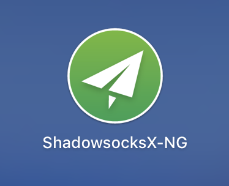
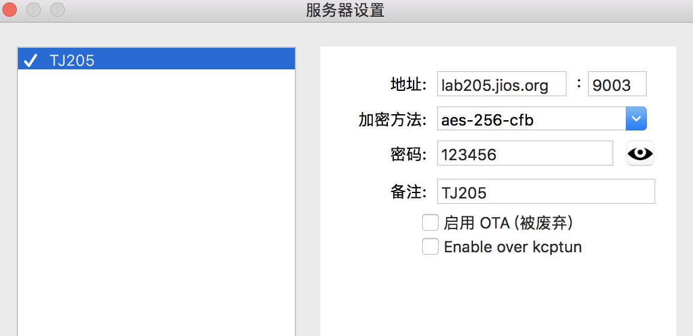
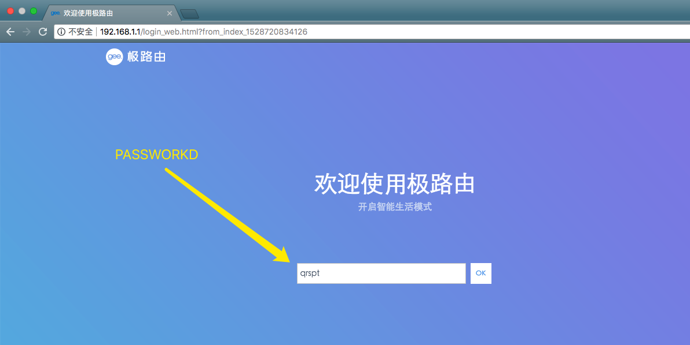

# Connect 205 environment through socket tunnel
1. Install shadowsocksX-NG client from [here](https://github.com/shadowsocks/ShadowsocksX-NG/releases/)

2. Configure the shadowsocks

3. Connect from chrome
