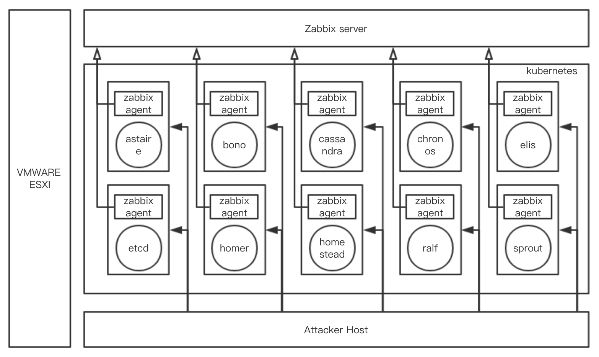

# Troubleshooting

## The deployment of 205 environment?
Shown as figure:



## How to ssh to environment(zabbix-server)?
```
ssh -p 9000 root@lab205.jios.org
```

## How to see the running status of the project?
```
kubectl get pods
```

## How to redeploy clearwater-docker project?
```
cd kubernetes
kubectl delete -f clearwater-205
# wait a few minutes ...
kubectl apply -f clearwater-205
```

## Can't accsee grafana web page?
Do as list:
- enter the kubernetes web page
- choice **kube-system** namespace
- edit *monitoring-grafana* service in serivce list as:
```
"spec": {
    "ports": [
      {
        "protocol": "TCP",
        "port": 80,
        "targetPort": 3000, # change here
        "nodePort": 30002
      }
    ],
    "type": "NodePort", # and here
    ...
  },
```